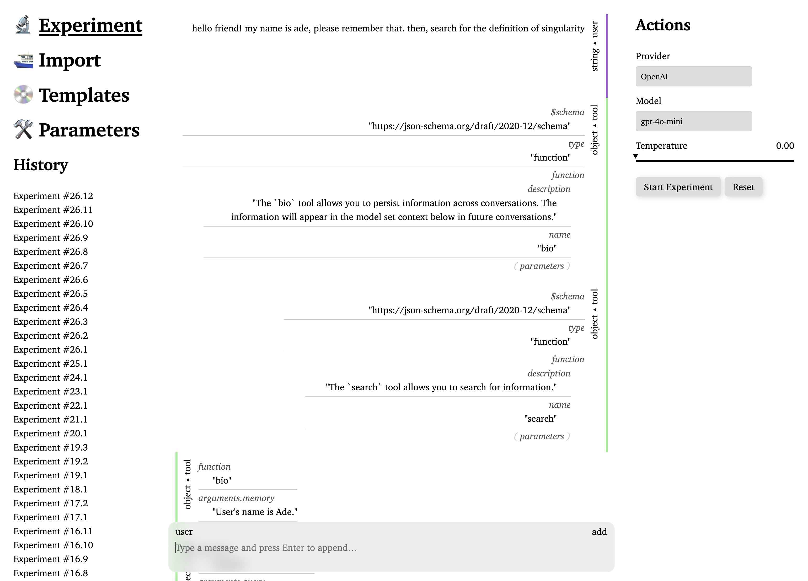

<a href="https://actualwitch.github.io/experiment/">
  <picture>
    <source media="(prefers-color-scheme: dark)" srcset=".github/screenshots/home-dark.png">
    
  </picture>
</a>

## 🔬 Let's start the <ins>Experiment</ins>

**Experiment** is a simple tool to facilitate prompt engineering. You can use it to make chat completion requests, debug function calling and explore completions saved as CSV.

## Development

This project uses custom architecture I refer to as "entangled atoms" which extends [jōtai](https://jotai.org/) atoms to synchronize state across different [realms](https://262.ecma-international.org/#realm). This allows for end-to-end isomorphic state management where same primitives are used to manage state everywhere. Unconventional nature of this approach led me to design my own boilerplate; after trying out different runtimes I decided to make use of [Bun](https://bun.sh/) which is very fast and offers neat features like macros and programmatically accessible bundler. You will need Bun installed to run this repo locally.

There is no Next.js, Remix, Vite, Webpack or Babel here; my aim is simplicity and minimalism in terms of requirements and general architecture. Currently, boilerplate implements full streaming Server-Side Rendering(SSR) with transparent bundling, hydration and Server-Sent Events(SSE) for state sync.

Shall you want to run this repo locally, you can do so by running `dev` script from Bun, dependencies will be installed automagically:

```sh
bun dev
```
