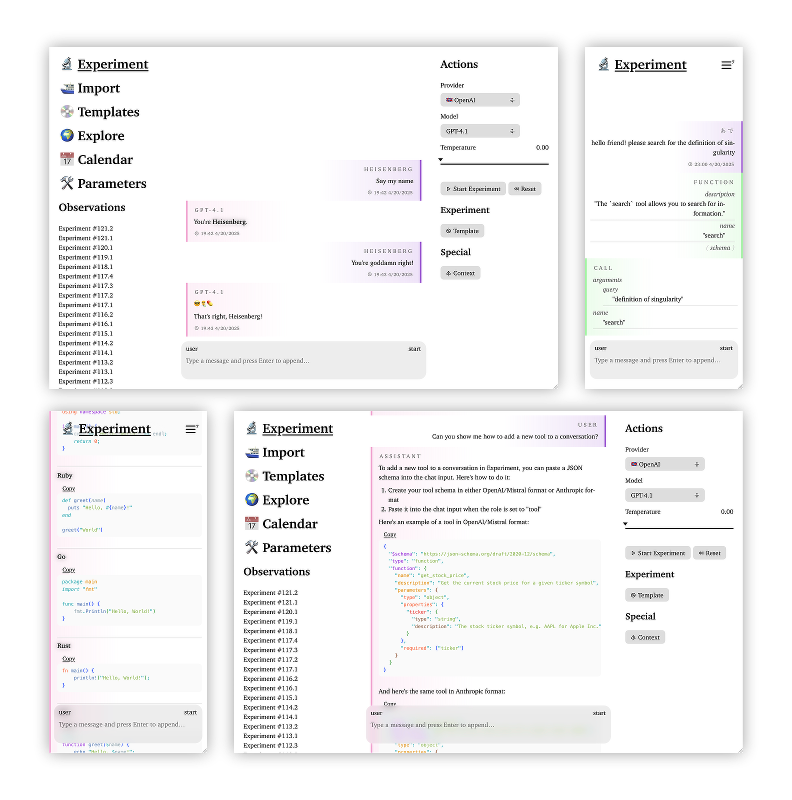

<a href="https://actualwitch.github.io/experiment/">
  <picture>
    <source media="(prefers-color-scheme: dark)" srcset=".github/screenshots/tapestry-dark.png">
    
  </picture>
</a>

<p align="center">
  <a href="https://actualwitch.github.io/experiment/">
    Web
  </a>
  ▴
  <a href="https://github.com/actualwitch/experiment/releases/latest">
    macOS
  </a>
  ▴
  <a href="https://github.com/actualwitch/experiment/releases/latest">
    Linux
  </a>
  ▴
  <a href="https://github.com/actualwitch/experiment/releases/latest">
    Windows
  </a>
</p>

# 🔬 Let's start the <ins>Experiment</ins>

[](https://github.com/actualwitch/experiment/actions/workflows/test.yml)

<ins>**Experiment**</ins> is an experimental chat interface for Large Language Models (LLMs) with function calling visualization support.

## Features

- 💬 **Multi-Provider Support**: Connect to Anthropic, OpenAI, and Mistral APIs with a unified interface
- 🧰 **Advanced Tool Debugging**: Visualize and manage tool interactions with JSON schema visualization
- 📂 **Include Context**: Add a directory to experiment and share its text content with the model
- 🔍 **Prompt Engineering**: Easily create, test, and iterate on prompts with real-time feedback
- 📊 **Import CSV**: Analyze previous completions from CSV files
- 🌐 **Universal Platform**: Available as both a web app and self-contained desktop application
- 📱 **Mobile Optimized**: Full-featured mobile version with Progressive Web App (PWA) support
- 🔐 **Secure by Design**: Store API tokens securely with optional 1Password integration (binary edition)
- 🖥️ **OLED-Friendly**: Dark mode uses true black for energy efficiency on OLED displays
- 🍻 **Free as in MIT**: All code is open source and permissively licensed
- 🙊 **Privacy First**: Your data stays local with no telemetry or tracking

## Getting Started

Experiment is available in binary and non-binary editions. Binary edition requires no dependencies and includes additional features like 1Password integration for secure token storage.

### Non-binary edition (Web/SPA)

Try the web version instantly at [actualwitch.github.io/experiment](https://actualwitch.github.io/experiment/)

### Binary edition (macOS/Linux/Windows)

[Download](https://github.com/actualwitch/experiment/releases/latest) the latest release for your platform and run it.

> [!NOTE]
> macOS and Linux users need to make the downloaded file executable:
> ```shell
> chmod +x ./experiment-*
> ```
> macOS users also need to remove quarantine:
> ```shell
> xattr -d com.apple.quarantine ./experiment-*
> ```

## Tool Debugging

<ins>**Experiment**</ins> provides comprehensive visualization for LLM tool use. Add tools by pasting a JSON schema into chat in OpenAI and Anthropic formats. The schema will be visualized with properties sorted by name and depth for easy navigation. Click on property names to collapse sections.

<a href="docs/tool-debugging.md">Read more about tool debugging →</a>

## Architecture

<ins>**Experiment**</ins> is an exploration of how next-generation isomorphic web app architecture could look like, using experimental, bleeding edge stack.

<a href="docs/architecture.md">Read more about the architecture →</a>

## Development

```shell
# Start development server
bun dev

# Build binary edition
bun run build:bin

# Build static site
bun run build:ssg
```

<hr>

Banner by <a href="https://unsplash.com/@jessbaileydesigns?utm_content=creditCopyText&utm_medium=referral&utm_source=unsplash">Jess Bailey</a> on <a href="https://unsplash.com/photos/pen-near-black-lined-paper-and-eyeglasses-q10VITrVYUM?utm_content=creditCopyText&utm_medium=referral&utm_source=unsplash">Unsplash</a>